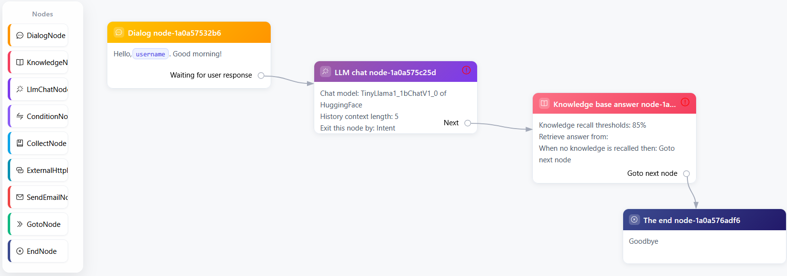
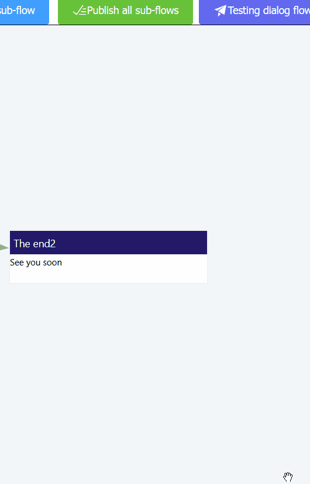

[简体中文](./README_zh-CN.md) | English

# Dialog flow AI
**only ONE executable file**, you can use it directly, including intent detection, AI management, a visual process editor and a response system.  
**ZERO installation**, no need to install any middleware such as Redis, Elastic Search, etc.  
  [](https://deepwiki.com/dialogflowai/dialogflow)






# ✨ Features
* 🛒 **Light** Only ONE executable file, it can run smoothly on laptops without GPUs (data files will be created at runtime automatically).
* 🐱‍🏍 **AI powered** Integrated `Huggingface local models (Llama, Phi-3, Gemma, Multilingual E5, MiniLM L6v2, NomicEmbedTextV1_5, etc.)`, and **any OpenAI-compatible endpoint** — `OpenAI`, `DeepSeek`, `Zhipu GLM`, `Qwen`, `Moonshot Kimi`, `SiliconFlow`, `Groq`, `OpenRouter`, `Ollama`, `vLLM`, `LM Studio`, or your own gateway. Just fill in the URL and API key. This can be used for `Chat`, `Text generation` and `Intent detection`.
* 🚀 **Fast** Built on Rust and Vue3.
* 😀 **Simple** Use the mouse to drag and drop with our intuitive node-based editor.
* 🔐 **Safe** 100% open source, all runtime data is saved locally (Using `OpenAI API` may expose some data).

# Give it a try!
* 🐋 **Docker** We provided an image on Docker Hub at [dialogflowai/dialogflow](https://hub.docker.com/r/dialogflowai/dialogflow/)
* 💻 **Binary releases**, please check [here](https://github.com/dialogflowai/dialogflow/releases)

> By default application will listen to `127.0.0.1:12715`, you can use `-ip` and `-port` specify new value, e.g.: `dialogflow -ip 0.0.0.0 -port 8888`

### Streaming answers

`POST /flow/answer` returns the answer in one document unless the request body asks
for `"stream": true`. Then the response is `application/x-ndjson`: one JSON frame per
line, each carrying a piece of an answer (`{"contentSeq": 0, "content": "..."}`), and
the last line is always a terminal frame (`contentSeq: null`) whose `content` is the
whole `{status, data, err}` response, so the final `nextAction` and `collectData`
arrive with it.

```bash
curl -N -H 'Content-Type: application/json' \
  -d '{"robotId":"...","mainFlowId":"...","userInput":"hi","stream":true}' \
  http://127.0.0.1:12715/flow/answer
```

A client that does not send `stream` gets exactly the JSON it got before 1.23. See
[doc/streaming.md](doc/streaming.md) for the full protocol, the Java/JavaScript client
contracts and the known limitations.

<!-- # Releases and source code
* 💾 If you're looking for **binary releases**, please check [here](https://github.com/dialogflowai/dialogflow/releases)
* 🎈 The **back end** of this application is [here](https://github.com/dialogflowchatbot/dialogflow-backend)
* 🎨 The **front end** of this application is [here](https://github.com/dialogflowchatbot/dialogflow-frontend) -->

# Check out introduction page
[https://dialogflowai.github.io/](https://dialogflowai.github.io/)

# Function nodes
|Node|Name|
|----|----|
||Dialog Node|
||Large language model chat node|
||Knowledge base answer node|
||Conditions node|
||Goto node|
||Collect node|
||External HTTP node|
||Send email node|
||The end node|

Using the different nodes above, to arrange and combine, you can get a conversational bot that can handle problems in different scenarios.

# Screenshots


### Trying a demo dialog flow


### Setup a condition branch


### Text generation


### Testing a dialog flow


# Get started

### Docker image
1. docker pull dialogflowai/demo
2. docker run -dp 127.0.0.1:12715:12715 --name dialogflowdemo dialogflowai/demo
3. Open your browser and visit: http://127.0.0.1:12715/

### Binary release
1. From [Github release page](https://github.com/dialogflowai/dialogflow/releases), depending on the operating system, download the application.
1. Run it directly, or use the `-ip` and `-port` parameters to perform the listening IP address and port, e.g.: `dialogflow -ip 0.0.0.0 -port 8888`.
1. Open your browser and visit http://localhost:12715 (by default) or http://`new IP`:`new port` to see the application in action
1. Add a main flow and click its name into it
1. Create dialog flow by dragging and drop nodes onto canvas
1. Test it
