简体中文 | [English](./README.md)

欢迎给本项目，或者给[Github上的项目](https://github.com/dialogflowai/dialogflow) ✨**Star**🎇!

# Dialog flow AI
**只有一个执行文件** 的AI工具，不用安装任何依赖就可以**直接使用**, 它包含了意图识别，AI模型管理，可视化的流程编辑器，和应答逻辑.  
**0安装**，无需安装类似Redis、ElasticSearch等中间件.  
 


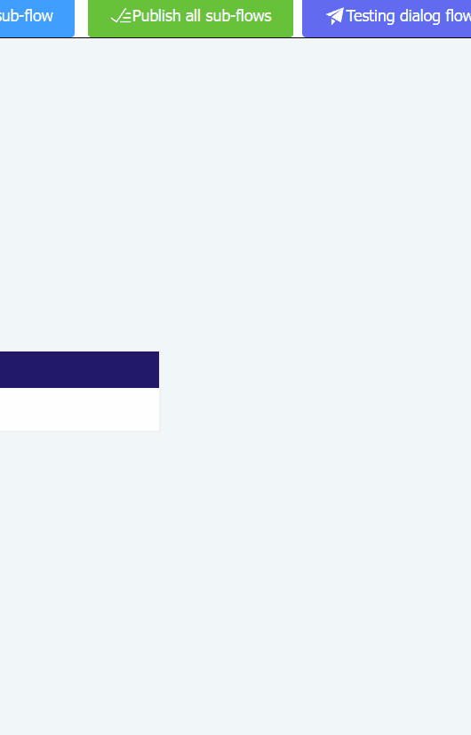

# ✨ 关键特性
* 🛒 **轻量级** 只有一个执行文件, 可以在没有GPU的笔记本上平滑的执行 (数据文件会在运行期动态的生成).
* 🐱‍🏍 **AI 驱动** 集成了 `Huggingface 本地模型 (Llama, Phi-3, Gemma, Multilingual E5, MiniLM L6v2, NomicEmbedTextV1_5 等其它模型)`, `Ollama` 和 `OpenAI`, 可以用于 `流程聊天`, `答案节点文本生成` 以及 `意图识别` 等.
* 🚀 **快速** 使用`Rust`和`Vue`构建.
* 😀 **简单** 通过使用可视化的流程编辑器，只需要用鼠标拖拽几个不同类型的节点, 即可创建一个简单的对话机器人.
* 🔐 **安全** 100% 开源, 所有运行时的数据, 都保存在本地 (使用 `OpenAI API` 可能会暴露一些数据).

# 现在就尝试一下!
* 🐋 **Docker** 我们提供了一个`Docker`镜像: [dialogflowai/dialogflow](https://hub.docker.com/r/dialogflowai/dialogflow/)
* 💻 **可直接执行的发布版本**, 请通过发布页: [点击这里](https://github.com/dialogflowai/dialogflow/releases) , 根据不同的平台下载（支持：Windows、Linux、macOS）

> 默认情况下, 应用会监听: `127.0.0.1:12715`, 你可以使用 `-ip` 参数和 `-port` 参数, 来指定新的监听地址和端口, 例如: `dialogflow -ip 0.0.0.0 -port 8888`

### 流式回答

`POST /flow/answer` 默认把回答放在一个 JSON 文档里返回；请求体里带上 `"stream": true`
才会按帧推送。此时响应是 `application/x-ndjson`，每行一个 JSON：`{"contentSeq": 0,
"content": "..."}` 是答案的一段，按 `contentSeq` 拼接即得到该答案全文；**最后一行必定是
终帧**（`contentSeq: null`），它的 `content` 是完整的 `{status, data, err}` 响应，
所以最终的 `nextAction`、`collectData` 都随它一起到达。

```bash
curl -N -H 'Content-Type: application/json' \
  -d '{"robotId":"...","mainFlowId":"...","userInput":"你好","stream":true}' \
  http://127.0.0.1:12715/flow/answer
```

不发 `stream` 的客户端拿到的，与 1.23 之前逐字节一致。完整协议、Java/JavaScript
客户端的约定以及已知限制见 [doc/streaming.md](doc/streaming.md)。

<!-- # Releases and source code
* 💾 If you're looking for **binary releases**, please check [here](https://github.com/dialogflowai/dialogflow/releases)
* 🎈 The **back end** of this application is [here](https://github.com/dialogflowchatbot/dialogflow-backend)
* 🎨 The **front end** of this application is [here](https://github.com/dialogflowchatbot/dialogflow-frontend) -->

# 查看详细介绍, 了解更多信息
[https://dialogflowai.github.io/#/?lang=zh](https://dialogflowai.github.io/#/?lang=zh)

# 功能节点列表
|节点|名称|
|----|----|
|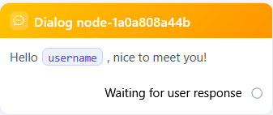|对话答案节点|
|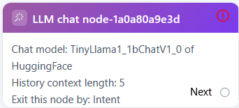|大模型聊天节点|
|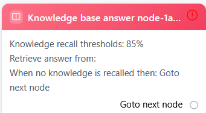|知识库答案节点|
|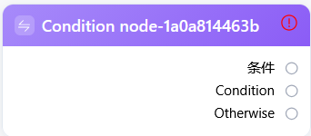|条件节点|
|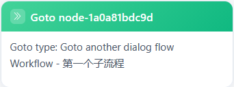|跳转节点|
|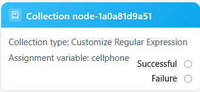|信息收集节点|
|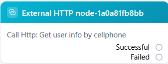|请求外部接口节点|
|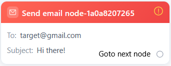|邮件发送节点|
|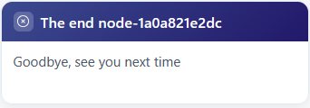|流程结束节点|

通过使用上面不同的节点来排列和组合, 就可以创建解决不同场景问题的机器人.

# 截图
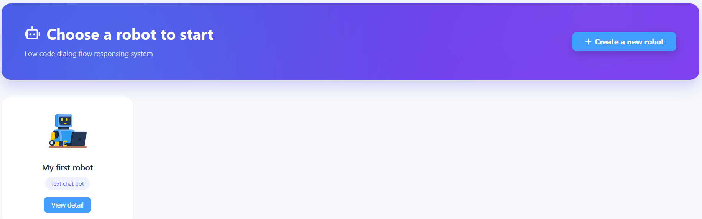

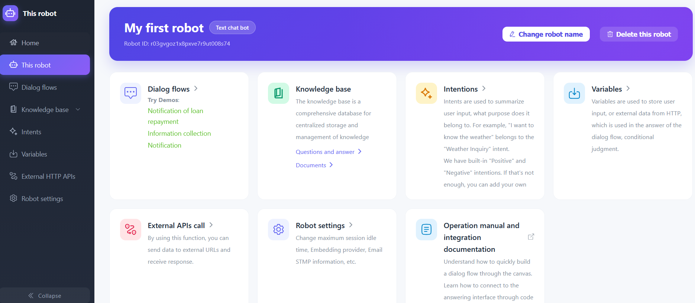

### 体验演示机器人


### 创建一个条件节点的分支


### 对话答案节点的自动文本生成


### 测试一个对话机器人


# 现在就开始使用

### Docker 镜像
1. docker pull dialogflowai/demo
2. docker run -dp 127.0.0.1:12715:12715 --name dialogflowdemo dialogflowai/demo
3. 打开浏览器并访问: http://127.0.0.1:12715/ 打开应用界面

### 发布版本
1. 从 [Github release page](https://github.com/dialogflowai/dialogflow/releases), 选择不同系统并下载.
1. 直接执行, 或者使用 `-ip` 和 `-port` 修改监听地址, 如: `dialogflow -ip 0.0.0.0 -port 8888`.
1. 打开浏览器并访问 http://localhost:12715 (默认) 或 http://`新的IP`:`新的端口` 打开应用界面
1. 进入一个机器人
2. 创建一个对话流程，并点击名称进入编辑器
1. 构建属于自己的机器人
1. 测试
